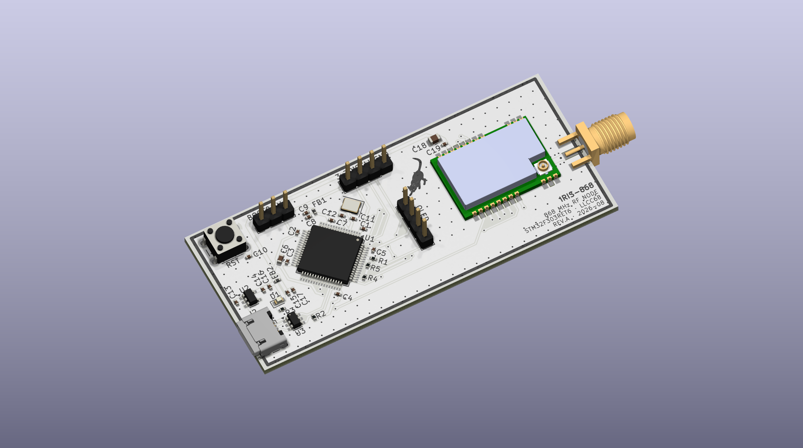
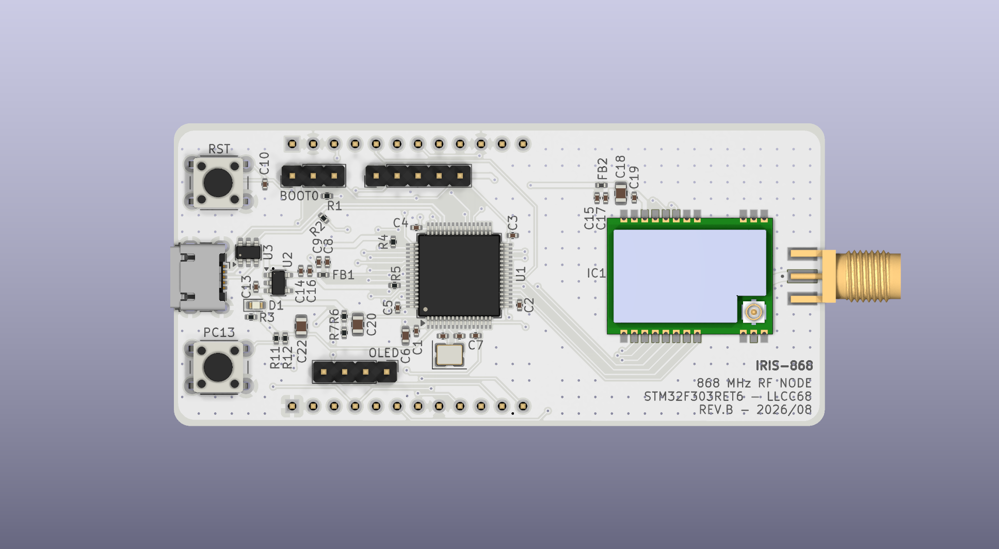
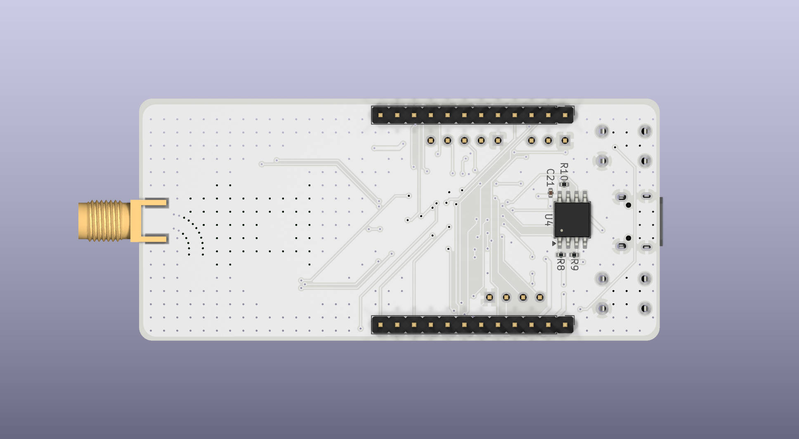
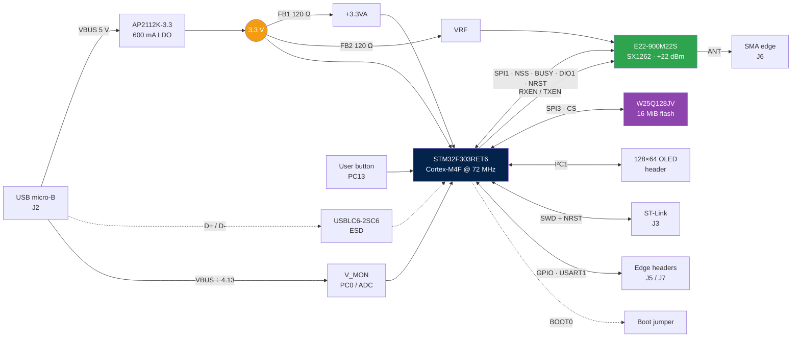

<div align="center">

# 📡 IRIS-868

**Custom embedded RF platform for the 868 MHz ISM band**

IRIS-868 is a custom embedded RF platform based on the STM32F303RET6 microcontroller and an Ebyte E22-900M22S (Semtech SX1262) sub-GHz LoRa module, designed for 868 MHz ISM-band wireless communication and data logging.

<br/>


<br/>



</div>

---

## ⚡ At a glance

|  |  |
|---|---|
| 🧠 **MCU** | STM32F303RET6 · Cortex-M4F @ 72 MHz · 512 KB flash · 64 + 16 KB RAM |
| 📻 **Radio** | Ebyte E22-900M22S · SX1262 · +22 dBm · LoRa / (G)FSK |
| 💾 **Storage** | Winbond W25Q128JV · 128 Mbit (16 MiB) SPI NOR flash for data logging |
| 🔌 **Power** | USB micro-B → AP2112K-3.3 LDO, filtered analog and RF rails, VBUS voltage monitoring on the ADC |
| 🧩 **Expansion** | 2 × 12-pin edge headers · I²C header for 128×64 OLED · 5-pin SWD with NRST · BOOT0 jumper · user button |
| 📐 **Board** | 2-layer FR4 · 78.8 × 36.6 mm · white mask, black silk · components on both sides |
| 🛠️ **Tooling** | KiCad 9, project-local libraries, no global config needed |

> [!WARNING]
> **Revision B is design-complete but has not been bring-up tested.** Fabrication files are released as-is. No firmware is included in this repository yet. See [Known limitations](#-known-limitations) before ordering.

## 📑 Table of contents

- [What's new in revision B](#-whats-new-in-revision-b)
- [Gallery](#%EF%B8%8F-gallery)
- [System architecture](#%EF%B8%8F-system-architecture)
- [Repository layout](#-repository-layout)
- [Hardware overview](#-hardware-overview)
- [Pin assignment](#-pin-assignment)
- [Board specification](#-board-specification)
- [Bill of materials](#-bill-of-materials)
- [Getting started](#-getting-started)
- [Known limitations](#-known-limitations)

## 🆕 What's new in revision B

| Area | Revision A | Revision B |
|---|---|---|
| **Expansion** | Most GPIOs unrouted | Two 1×12 edge headers (J5, J7) bring out power, reset, BOOT0, USART1 and 13 GPIOs |
| **Debug** | 4-pin SWD, no NRST | 5-pin SWD **with NRST** — "connect under reset" now works |
| **Storage** | — | 16 MiB W25Q128JV SPI flash on SPI3 (bottom side) |
| **User input** | Reset button only | Additional user button on **PC13** with RC debounce |
| **Monitoring** | — | VBUS divider (47 kΩ / 15 kΩ) on **PC0** for USB voltage measurement |
| **USB** | D+ pull-up fixed to +3.3 V | D+ pull-up driven by **PB8** — firmware-controlled attach/detach |
| **Radio** | E220-900M22S (LLCC68) | E22-900M22S (SX1262), same pinout and pin assignment |
| **Board** | 74.2 × 32.0 mm, single-sided assembly | 78.8 × 36.6 mm, bottom-side SMD parts and headers |

## 🖼️ Gallery

<div align="center">

| Front | Back |
|:---:|:---:|
|  |  |

</div>

📄 Full schematic: [`docs/schematics/IRIS-868.pdf`](docs/schematics/IRIS-868.pdf)

## 🏗️ System architecture



## 📁 Repository layout

```
IRIS-868/
├── hardware/
│   ├── kicad/                 KiCad 9 project (schematic, PCB, design rules)
│   │   └── libs/              Project-local symbols, footprints, 3D models
│   └── gerbers/rev.B/         Gerber X2 + Excellon drill files
└── docs/
    ├── schematics/            Schematic PDF
    ├── images/                Board renders
    └── datasheets/            Component reference documents
```

The schematic is hierarchical: the root sheet (`IRIS-868.kicad_sch`) holds the MCU, crystal, reset, buttons, VBUS monitor, flash and headers, with sub-sheets for power and USB (`pwr.kicad_sch`), the radio (`rf.kicad_sch`) and connectors (`interfaces.kicad_sch`).

## 🔧 Hardware overview

### Power

USB VBUS feeds an **AP2112K-3.3** LDO (SOT-23-5, 600 mA) that generates the single 3.3 V system rail. Three domains branch from it:

| Rail | Source | Decoupling | Purpose |
|---|---|---|---|
| `+3.3V` | LDO output | 10 µF + 7 × 100 nF + 2 × 1 µF | MCU digital, I/O, flash, headers |
| `+3.3VA` | via FB1 (120 Ω ferrite) | 1 µF + 10 nF | STM32 VDDA / analog reference |
| `VRF` | via FB2 (120 Ω ferrite) | 22 µF + 1 µF + 2 × 100 nF | RF module supply |

The ferrite beads isolate the analog and RF domains from digital switching noise on the main rail. The 22 µF bulk capacitor on `VRF` supplies the current burst drawn by the module during transmission.

VBUS and +3.3 V are both available on header J5, so the board can supply a small carrier or add-on board.

### VBUS monitoring

A 47 kΩ / 15 kΩ divider (R6 / R7) scales VBUS onto `V_MON` (**PC0**, ADC12_IN6), filtered by C20 (100 nF). The divider ratio is 15 / 62, so 5.0 V on VBUS reads as about 1.21 V, and firmware recovers VBUS as `V_MON × 4.133`. The divider draws roughly 80 µA from VBUS, and its ~11 kΩ source impedance combined with C20 gives a stable input for the ADC sample-and-hold.

### RF chain

The E22-900M22S connects to the MCU over SPI1 plus four control lines. `RXEN` and `TXEN` drive the module's internal RF switch and must be managed by firmware around every transmit/receive transition. The antenna net (`ANT`) runs from the module's stamp-hole RF pad to the SMA edge connector as a short (≈ 4.6 mm), 1.0 mm-wide ground-referenced coplanar trace on F.Cu; a project-specific design rule enforces a 0.15 mm gap to the surrounding copper pour along this net.

### Data-logging flash

A **Winbond W25Q128JVSIQ** (SOIC-8, 208 mil) on the bottom side provides 16 MiB of non-volatile storage on **SPI3** (PC10 / PC11 / PC12) with chip select on **PD2**. The CS line has a 10 kΩ pull-up (R8) so the flash stays deselected while the MCU is in reset. `/WP` and `/HOLD` are tied high through R9 and R10, so the device operates in standard single-bit SPI mode; dual/quad I/O is not available on this revision. C21 decouples the flash locally.

### User input and reset

| Button | Net | Circuit |
|---|---|---|
| **RST** | NRST (pin 7) | Pulls NRST low, 100 nF (C10) on the line. NRST is also on the SWD header and J5 |
| **PC13** | PC13 (pin 2) | Active-low. 10 kΩ pull-up (R11), 10 kΩ series (R12), 100 nF (C22) to GND — about 1 ms fall / 2 ms rise debounce |

### USB

The USB D+ 1.5 kΩ pull-up (R2) is connected to **PB8** rather than to +3.3 V. Firmware must drive PB8 high to signal device attach to the host, and can drive it low to force a clean disconnect/re-enumeration without unplugging the cable. See [Known limitations](#-known-limitations) for the effect on the ROM DFU bootloader.

### Interfaces

| Connector | Type | Pinout |
|---|---|---|
| **J2** USB | micro-B | USB FS device on PA11/PA12, D+ pull-up switched by PB8, ESD-protected |
| **J3** SWD | 1×5 @ 2.54 mm | `GND` · `NRST` · `SWCLK` · `SWDIO` · `+3.3V` |
| **BOOT0** | 1×3 @ 2.54 mm | `GND` · `BOOT0` · `+3.3V` — jumper 1–2 = flash, 2–3 = bootloader |
| **OLED** | 1×4 @ 2.54 mm | `GND` · `+3.3V` · `SCL` · `SDA` (1.5 kΩ pull-ups on board) |
| **J5** | 1×12 @ 2.54 mm, bottom-mounted | Power, reset, BOOT0, USART1, GPIO — see below |
| **J7** | 1×12 @ 2.54 mm, bottom-mounted | GPIO — see below |
| **J6** SMA | edge-mount | Antenna |

### Edge headers

J5 and J7 run along the long edges of the board with a row-to-row spacing of 31.75 mm (1.25 in). The header bodies are mounted on the bottom side, so the board can be plugged into a carrier with the components facing up. Pin 1 of each header is at the USB end.

| Pin | **J5** | **J7** |
|:---:|---|---|
| 1 | `GND` | `PB9` |
| 2 | `+3.3V` | `GND` |
| 3 | `VBUS` (5 V) | `PB0` |
| 4 | `NRST` | `PB1` |
| 5 | `BOOT0` | `PC4` |
| 6 | `PA9` (USART1_TX) | `PC5` |
| 7 | `PA10` (USART1_RX) | `PC6` |
| 8 | `GND` | `PC7` |
| 9 | `PB4` | `PC8` |
| 10 | `PB5` | `GND` |
| 11 | `PB6` | not connected |
| 12 | `PB8` ⚠️ USB D+ pull-up | not connected |

## 📌 Pin assignment

### STM32F303RET6 ↔ E22-900M22S

| STM32 pin | Signal | Module pin | Direction | Function |
|---|---|---|:---:|---|
| `PA5` | SPI1_SCK | 18 (SCK) | → | SPI clock |
| `PA6` | SPI1_MISO | 16 (MISO) | ← | SPI data out |
| `PA7` | SPI1_MOSI | 17 (MOSI) | → | SPI data in |
| `PA4` | NSS | 19 (NSS) | → | Chip select, active low |
| `PA3` | NRST | 15 (NRST) | → | Module reset, active low |
| `PA2` | BUSY | 14 (BUSY) | ← | Transceiver busy status |
| `PA8` | DIO1 | 13 (DIO1) | ← | Primary interrupt line |
| `PB10` | RXEN | 6 (RXEN) | → | RF switch, receive enable |
| `PB11` | TXEN | 7 (TXEN) | → | RF switch, transmit enable |

Module pin 8 (DIO2) is left unconnected in revision B.

### STM32F303RET6 ↔ W25Q128JV

| STM32 pin | Signal | Flash pin | Direction |
|---|---|---|:---:|
| `PC10` | SPI3_SCK | 6 (CLK) | → |
| `PC11` | SPI3_MISO | 2 (DO) | ← |
| `PC12` | SPI3_MOSI | 5 (DI) | → |
| `PD2` | FLASH_CS | 1 (/CS) | → |

<details>
<summary><b>Other pin assignments</b></summary>

<br/>

| STM32 pin | Function |
|---|---|
| `PA11` / `PA12` | USB D− / D+ |
| `PB8` | USB D+ pull-up control (also on J5 pin 12) |
| `PA13` / `PA14` | SWDIO / SWCLK |
| `PA15` | I²C1 SCL (AF4) |
| `PB7` | I²C1 SDA (AF4) |
| `PC0` | V_MON — VBUS voltage divider (ADC) |
| `PC13` | User button, active low |
| `PF0` / `PF1` | 16 MHz crystal (OSC_IN / OSC_OUT) |
| `NRST` (pin 7) | Reset button + 100 nF, SWD header, J5 |
| `BOOT0` (pin 60) | BOOT0 jumper via 10 kΩ, J5 (direct) |
| `PA9`, `PA10`, `PB4`–`PB6` | J5 |
| `PB0`, `PB1`, `PB9`, `PC4`–`PC8` | J7 |

The remaining GPIOs — `PA0`, `PA1`, `PB2`, `PB3`, `PB12`–`PB15`, `PC1`–`PC3`, `PC9`, `PC14`, `PC15` — are **not routed** in revision B.

</details>

## 📐 Board specification

| Parameter | Value |
|---|---|
| Dimensions | 78.8 × 36.6 mm, 2 mm corner radius |
| Layers | 2 (F.Cu / B.Cu), GND pour on both |
| Stackup | 1.6 mm FR4, 35 µm copper, εr 4.5 |
| Surface finish | HASL |
| Vias | 369 |
| Assembly | Double-sided (U4, R8–R10, C21 and header bodies on the bottom) |
| Special rules | 0.15 mm clearance on the `ANT` coplanar feedline |

## 🧾 Bill of materials

<details>
<summary><b>Full BOM — 52 components</b></summary>

<br/>

| Ref | Qty | Value | Package | Notes |
|---|:---:|---|---|---|
| U1 | 1 | STM32F303RET6 | LQFP-64 | 0.5 mm pitch |
| U2 | 1 | AP2112K-3.3 | SOT-23-5 | 600 mA LDO |
| U3 | 1 | USBLC6-2SC6 | SOT-23-6 | USB ESD protection |
| U4 | 1 | W25Q128JVSIQ | SOIC-8 5.3 × 5.3 mm | 128 Mbit SPI flash, **bottom side** |
| IC1 | 1 | E22-900M22S | Ebyte SMD module | SX1262, +22 dBm |
| Y1 | 1 | 16 MHz | 3225-4pin | ≤20 ppm recommended |
| C1–C5, C10, C16, C17, C19, C21 | 10 | 100 nF | 0402 | 16 V X7R — C21 on bottom side |
| C20, C22 | 2 | 100 nF | 0805 | 16 V X7R — V_MON filter, PC13 debounce |
| C8, C9, C14, C15 | 4 | 1 µF | 0402 | 16 V X5R/X7R |
| C13 | 1 | 1 µF | 0402 | **25 V** — sits on the 5 V VBUS rail |
| C6 | 1 | 10 µF | 0603 | 16 V X5R |
| C18 | 1 | 22 µF | 0805 | 16 V X5R, RF bulk |
| C7 | 1 | 10 nF | 0402 | 16 V X7R, VDDA filter |
| C11, C12 | 2 | 12 pF | 0402 | **50 V C0G/NP0 ±5%**, crystal load |
| R1 | 1 | 10 kΩ | 0402 | BOOT0 series |
| R2 | 1 | 1.5 kΩ | 0402 | USB D+ pull-up (to PB8) |
| R3 | 1 | 1.5 kΩ | 0402 | Power LED series |
| R4, R5 | 2 | 1.5 kΩ | 0402 | I²C pull-ups |
| R6 | 1 | 47 kΩ | 0402 | VBUS divider, top — 1% recommended |
| R7 | 1 | 15 kΩ | 0402 | VBUS divider, bottom — 1% recommended |
| R8, R9, R10 | 3 | 10 kΩ | 0402 | Flash /CS, /WP, /HOLD pull-ups, **bottom side** |
| R11, R12 | 2 | 10 kΩ | 0402 | PC13 button pull-up / series |
| FB1, FB2 | 2 | 120 Ω @ 100 MHz | 0402 | Analog / RF rail filtering |
| D1 | 1 | Red LED | 0603 | Power indicator |
| RST, PC13 | 2 | Tactile switch | 6 mm THT | 4-pin, 4.5 × 6.5 mm |
| BOOT0 | 1 | Pin header 1×3 | 2.54 mm | BOOT0 select |
| J2 | 1 | USB micro-B | Würth 629105150521 | |
| J3 | 1 | Pin header 1×5 | 2.54 mm | SWD + NRST |
| OLED | 1 | Pin header 1×4 | 2.54 mm | I²C / OLED |
| J5, J7 | 2 | Pin header 1×12 | 2.54 mm | Edge headers, **bottom side** |
| J6 | 1 | SMA edge-mount | RF Solutions CON-SMA-EDGE-S | |

</details>

> [!TIP]
> Capacitor voltage ratings account for MLCC **DC bias derating** — class II ceramics lose a large fraction of their nominal capacitance near their rated voltage, so ratings are specified at roughly 4–5× the working voltage. Don't forget to order a **2.54 mm jumper shunt** for the BOOT0 header; it isn't part of the PCB BOM.

## 🚀 Getting started

<details open>
<summary><b>1 · Fabricate the board</b></summary>

<br/>

Fabrication files for revision B are in [`hardware/gerbers/rev.B/`](hardware/gerbers/rev.B/), in Gerber X2 format with Excellon drill files. They can be uploaded directly to most fabricators.

- Process: standard 2-layer, 1.6 mm FR4, HASL or ENIG
- No controlled impedance is specified
- Revision B has SMD parts on **both sides**. If using assembly service, request double-sided assembly or have the bottom-side parts (U4, R8–R10, C21) left unpopulated and fit them by hand
- Suggested hand-assembly order: bottom-side SMD parts first, then the STM32 (drag solder, then inspect with flux and a loupe), then the remaining ICs, then passives, then the module, then through-hole parts last — edge headers J5/J7 go in from the bottom

</details>

<details>
<summary><b>2 · Open the design</b></summary>

<br/>

The project requires **KiCad 9** or later. Symbols, footprints and 3D models for the non-standard parts (E22 module, SMA edge connector) live under `hardware/kicad/libs/` and are referenced with project-relative paths, so the project opens without any global library configuration.

```bash
git clone -b v2 https://github.com/StringLess80/IRIS-868.git
cd IRIS-868
kicad hardware/kicad/IRIS-868.kicad_pro
```

</details>

<details>
<summary><b>3 · Program it</b></summary>

<br/>

**Via SWD (recommended)** — connect an ST-Link or any CMSIS-DAP probe to J3, including the NRST line. Because NRST is on the header, "connect under reset" works, so a board with firmware that disables SWD or enters low-power mode early can still be recovered from the debugger.

```bash
st-flash --reset write firmware.bin 0x08000000
```

**Via UART bootloader** — connect a 3.3 V USB-serial adapter to J5 (`PA9` = MCU TX, `PA10` = MCU RX, `GND`), move the BOOT0 jumper to pins 2–3 and reset:

```bash
stm32flash -w firmware.bin -v -g 0x0 /dev/ttyUSB0
```

**Via USB DFU** — the ROM bootloader does not drive PB8, so the D+ pull-up is inactive and the host will not see the device (see [Known limitations](#-known-limitations)). Tie J5 pin 12 (`PB8`) to J5 pin 2 (`+3.3V`) for the duration of the DFU session, move the BOOT0 jumper to pins 2–3, reset, then:

```bash
dfu-util -a 0 -s 0x08000000:leave -D firmware.bin
```

> [!CAUTION]
> Remove the PB8 link before running application firmware — if firmware drives PB8 low while it is tied to +3.3 V, the pin is shorted.

Move the jumper back to pins 1–2 and reset to run from flash.

</details>

## 🐛 Known limitations

Revision B has the following documented issues and constraints:

| # | Issue | Impact | Workaround |
|:---:|---|---|---|
| 1 | **BOOT0 needs a jumper** — R1 is wired in series between BOOT0 and the jumper header, not as a fixed pull-down, so BOOT0 floats with no shunt fitted (unless driven through J5 pin 5) | Boot mode is undefined after reset | Always keep a jumper on the BOOT0 header, pins 1–2 for normal operation |
| 2 | **USB D+ pull-up depends on PB8** | ROM USB DFU bootloader cannot enumerate; PB8 on J5 is effectively reserved for USB | Use SWD or the UART bootloader, or link PB8 to +3.3 V during DFU. Don't load J5 pin 12 when USB is used |
| 3 | **Flash wired for single SPI only** — /WP and /HOLD are pulled up, not routed to the MCU | No dual/quad I/O | None needed for most logging workloads |
| 4 | **Some GPIOs still unrouted** — `PA0`, `PA1`, `PB2`, `PB3`, `PB12`–`PB15`, `PC1`–`PC3`, `PC9`, `PC14`, `PC15`; J7 pins 11–12 are unused | Fewer I/Os than the MCU offers | Rework |

Resolved from revision A: NRST is now on the SWD header, and most previously unrouted GPIOs are available on J5 / J7.

<div align="center">
<br/>

Made with [KiCad](https://www.kicad.org/) 🛠️

</div>
