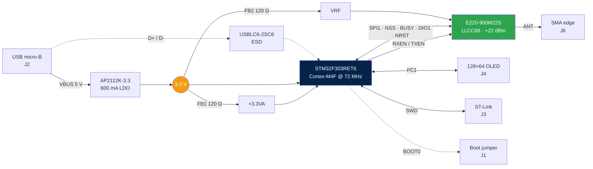

<div align="center">

# 📡 IRIS-868

**Custom embedded RF platform for the 868 MHz ISM band**

IRIS-868 is a custom embedded RF platform based on the STM32F303RET6 microcontroller and Semtech LLCC68 sub-GHz transceiver, designed for 868 MHz ISM-band wireless communication.

<br/>


<br/>


</div>

---

## ⚡ At a glance

|  |  |
|---|---|
| 🧠 **MCU** | STM32F303RET6 · Cortex-M4F @ 72 MHz · 512 KB flash · 64 + 16 KB RAM |
| 📻 **Radio** | Ebyte E220-900M22S · LLCC68 · +22 dBm · LoRa / (G)FSK |
| 🔌 **Power** | USB micro-B → AP2112K-3.3 LDO, filtered analog and RF rails |
| 🧩 **Expansion** | I²C header for 128×64 OLED · SWD · BOOT0 jumper |
| 📐 **Board** | 2-layer FR4 · 74.2 × 32.0 mm · white mask, black silk |
| 🛠️ **Tooling** | KiCad 9, project-local libraries, no global config needed |

> [!WARNING]
> **Revision A is design-complete but has not been bring-up tested.** Fabrication files are released as-is. No firmware is included in this repository yet. See [Known limitations](#-known-limitations) before ordering.

## 📑 Table of contents

- [Gallery](#-gallery)
- [System architecture](#-system-architecture)
- [Repository layout](#-repository-layout)
- [Hardware overview](#-hardware-overview)
- [Pin assignment](#-pin-assignment)
- [Board specification](#-board-specification)
- [Bill of materials](#-bill-of-materials)
- [Getting started](#-getting-started)
- [Known limitations](#-known-limitations)

## 🖼️ Gallery

<div align="center">

| Front | Back |
|:---:|:---:|
|  |  |

</div>

📄 Full schematic: [`docs/schematics/IRIS-868.pdf`](docs/schematics/IRIS-868.pdf)

## 🏗️ System architecture



## 📁 Repository layout

```
IRIS-868/
├── hardware/
│   ├── kicad/                 KiCad 9 project (schematic, PCB, design rules)
│   │   └── libs/              Project-local symbols, footprints, 3D models
│   └── gerbers/rev.A/         Gerber X2 + Excellon drill files
└── docs/
    ├── schematics/            Schematic PDF
    ├── images/                Board renders
    └── datasheets/            Component reference documents
```

## 🔧 Hardware overview

### Power

USB VBUS feeds an **AP2112K-3.3** LDO (SOT-23-5, 600 mA) that generates the single 3.3 V system rail. Three domains branch from it:

| Rail | Source | Decoupling | Purpose |
|---|---|---|---|
| `+3.3V` | LDO output | 10 µF + 6 × 100 nF + 2 × 1 µF | MCU digital, I/O, headers |
| `+3.3VA` | via FB1 (120 Ω ferrite) | 1 µF + 10 nF | STM32 VDDA / analog reference |
| `VRF` | via FB2 (120 Ω ferrite) | 22 µF + 1 µF + 2 × 100 nF | RF module supply |

The ferrite beads isolate the analog and RF domains from digital switching noise on the main rail. The 22 µF bulk capacitor on `VRF` supplies the current burst drawn by the module during transmission.

### RF chain

The E220-900M22S connects to the MCU over SPI1 plus four control lines. `RXEN` and `TXEN` drive the module's internal RF switch and must be managed by firmware around every transmit/receive transition. The antenna net (`ANT`) runs from the module's stamp-hole RF pad to the SMA edge connector as a ground-referenced coplanar trace; a project-specific design rule enforces a 0.15 mm gap to the surrounding copper pour along this net.

### Interfaces

| Connector | Type | Pinout |
|---|---|---|
| **J2** USB | micro-B | USB FS device on PA11/PA12, 1.5 kΩ pull-up on D+, ESD-protected |
| **J3** SWD | 1×4 @ 2.54 mm | `GND` · `SWCLK` · `SWDIO` · `+3.3V` |
| **J1** PRG | 1×3 @ 2.54 mm | `GND` · `BOOT0` · `+3.3V` — jumper 1–2 = flash, 2–3 = bootloader |
| **J4** OLED | 1×4 @ 2.54 mm | `GND` · `+3.3V` · `SCL` · `SDA` (1.5 kΩ pull-ups on board) |
| **J6** SMA | edge-mount | Antenna |

## 📌 Pin assignment

### STM32F303RET6 ↔ E220-900M22S

| STM32 pin | Signal | Module pin | Direction | Function |
|---|---|---|:---:|---|
| `PA5` | SPI1_SCK | 18 (SCK) | → | SPI clock |
| `PA6` | SPI1_MISO | 16 (MISO) | ← | SPI data out |
| `PA7` | SPI1_MOSI | 17 (MOSI) | → | SPI data in |
| `PA4` | NSS | 19 (NSS) | → | Chip select, active low |
| `PA3` | NRST | 15 (NRST) | → | Module reset, active low |
| `PA2` | BUSY | 14 (BUSY) | ← | Transceiver busy status |
| `PA8` | DIO1 | 13 (DIO1) | ← | Primary interrupt line |
| `PB10` | RXEN | 6 (RXEN) | → | RF switch, receive enable |
| `PB11` | TXEN | 7 (TXEN) | → | RF switch, transmit enable |

Module pin 8 (DIO2) is left unconnected in revision A.

<details>
<summary><b>Other pin assignments</b></summary>

<br/>

| STM32 pin | Function |
|---|---|
| `PA11` / `PA12` | USB D− / D+ |
| `PA13` / `PA14` | SWDIO / SWCLK |
| `PA15` | I²C1 SCL (AF4) |
| `PB7` | I²C1 SDA (AF4) |
| `PF0` / `PF1` | 16 MHz crystal (OSC_IN / OSC_OUT) |
| `NRST` (pin 7) | Reset button + 100 nF |
| `BOOT0` (pin 60) | J1 jumper via 10 kΩ |

All remaining GPIOs — `PA0`, `PA1`, `PA9`, `PA10`, `PB0`–`PB6`, `PB8`, `PB9`, `PB12`–`PB15`, `PC0`–`PC15`, `PD2` — are named in the schematic but are **not routed to any connector** in revision A. They are reserved for future expansion.

</details>

## 📐 Board specification

| Parameter | Value |
|---|---|
| Dimensions | 74.2 × 32.0 mm |
| Layers | 2 (F.Cu / B.Cu) |
| Stackup | 1.6 mm FR4, 35 µm copper, εr 4.5 |
| Vias | 247 |
| Special rules | 0.15 mm clearance on the `ANT` coplanar feedline |

## 🧾 Bill of materials

<details>
<summary><b>Full BOM — 39 components</b></summary>

<br/>

| Ref | Qty | Value | Package | Notes |
|---|:---:|---|---|---|
| U1 | 1 | STM32F303RET6 | LQFP-64 | 0.5 mm pitch |
| U2 | 1 | AP2112K-3.3 | SOT-23-5 | 600 mA LDO |
| U3 | 1 | USBLC6-2SC6 | SOT-23-6 | USB ESD protection |
| IC1 | 1 | E220-900M22S | Ebyte SMD module | LLCC68, +22 dBm |
| Y1 | 1 | 16 MHz | 3225-4pin | ≤20 ppm recommended |
| C1–C5, C10, C16, C17, C19 | 9 | 100 nF | 0402 | 16 V X7R |
| C8, C9, C14, C15 | 4 | 1 µF | 0402 | 16 V X5R/X7R |
| C13 | 1 | 1 µF | 0402 | **25 V** — sits on the 5 V VBUS rail |
| C6 | 1 | 10 µF | 0603 | 16 V X5R |
| C18 | 1 | 22 µF | 0805 | 16 V X5R, RF bulk |
| C7 | 1 | 10 nF | 0402 | 16 V X7R, VDDA filter |
| C11, C12 | 2 | 12 pF | 0402 | **50 V C0G/NP0 ±5%**, crystal load |
| R1 | 1 | 10 kΩ | 0402 | BOOT0 series |
| R2 | 1 | 1.5 kΩ | 0402 | USB D+ pull-up |
| R3 | 1 | 1.5 kΩ | 0402 | Power LED series |
| R4, R5 | 2 | 1.5 kΩ | 0402 | I²C pull-ups |
| FB1, FB2 | 2 | 120 Ω @ 100 MHz | 0402 | Analog / RF rail filtering |
| D1 | 1 | Red LED | 0603 | Power indicator |
| RST | 1 | Tactile switch | 6 mm THT | 4-pin, 4.5 × 6.5 mm |
| J1 | 1 | Pin header 1×3 | 2.54 mm | BOOT0 select |
| J2 | 1 | USB micro-B | Würth 629105150521 | |
| J3 | 1 | Pin header 1×4 | 2.54 mm | SWD |
| J4 | 1 | Pin header 1×4 | 2.54 mm | I²C / OLED |
| J6 | 1 | SMA edge-mount | RF Solutions CON-SMA-EDGE-S | |

</details>

> [!TIP]
> Capacitor voltage ratings account for MLCC **DC bias derating** — class II ceramics lose a large fraction of their nominal capacitance near their rated voltage, so ratings are specified at roughly 4–5× the working voltage. Don't forget to order **2.54 mm jumper shunts** for J1; they aren't part of the PCB BOM.

## 🚀 Getting started

<details open>
<summary><b>1 · Fabricate the board</b></summary>

<br/>

Fabrication files for revision A are in [`hardware/gerbers/rev.A/`](hardware/gerbers/rev.A/), in Gerber X2 format with Excellon drill files. They can be uploaded directly to most fabricators.

- Process: standard 2-layer, 1.6 mm FR4, HASL or ENIG
- No controlled impedance is specified
- Suggested hand-assembly order: STM32 first (drag solder, then inspect with flux and a loupe), then the remaining ICs, then passives, then the module, then through-hole parts last

</details>

<details>
<summary><b>2 · Open the design</b></summary>

<br/>

The project requires **KiCad 9** or later. Symbols, footprints and 3D models for the non-standard parts (E220 module, SMA edge connector) live under `hardware/kicad/libs/` and are referenced with project-relative paths, so the project opens without any global library configuration.

```bash
git clone https://github.com/StringLess80/IRIS-868.git
cd IRIS-868
kicad hardware/kicad/IRIS-868.kicad_pro
```

</details>

<details>
<summary><b>3 · Program it</b></summary>

<br/>

**Via SWD** — connect an ST-Link or any CMSIS-DAP probe to J3.

> [!IMPORTANT]
> NRST is **not** present on the debug header, so "connect under reset" is not available. If firmware reconfigures PA13/PA14 or enters a low-power mode early in startup, recovery requires the bootloader route below.

**Via USB DFU** — move the J1 jumper to pins 2–3, reset the board, then flash over USB:

```bash
dfu-util -a 0 -s 0x08000000:leave -D firmware.bin
```

Move the jumper back to pins 1–2 and reset to run from flash.

</details>

## 🐛 Known limitations

Revision A has the following documented issues and constraints:

| # | Issue | Impact | Workaround |
|:---:|---|---|---|
| 1 | **BOOT0 needs a jumper** — R1 is wired in series between BOOT0 and J1, not as a fixed pull-down, so BOOT0 floats with no shunt fitted | Boot mode is undefined after reset | Always keep a jumper on J1, pins 1–2 for normal operation |
| 2 | **No NRST on the SWD header** | No "connect under reset" recovery | Use the USB DFU bootloader |
| 3 | **Unrouted GPIOs** | Most MCU pins are inaccessible | Rework, or wait for revision B |

<div align="center">
<br/>

Made with [KiCad](https://www.kicad.org/) 🛠️

</div>